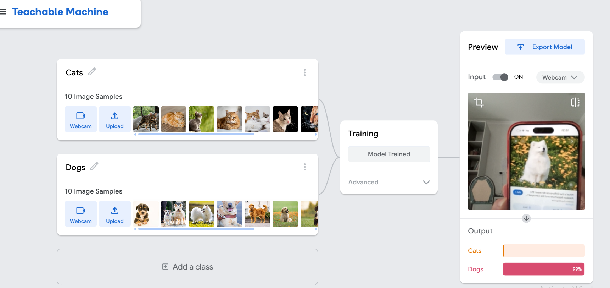

# ML jarayoni va model baholash: Train, Test, Evaluate bosqichlari

**Mentor:** Dilrabo Xidirova
**Loyiha:** "Al-Xorazmiy vorislari" mentorlik dasturi
**Yo'nalish:** Artificial Intelligence & Machine Learning
**Auditoriya:** 8–11-sinf o'quvchilari
**Davomiyligi:** 20 daqiqa (demo dars, video-yozib olinadi)

## Dars haqida

Ushbu demo dars o'quvchilarni Machine Learning jarayonining asosiy bosqichlari — **ma'lumot to'plash, train (o'qitish), test (sinash) va evaluate (baholash)** — bilan tanishtiradi. Dars kod yozmasdan, to'liq interaktiv va vizual formatda o'tiladi, so'ngida esa haqiqiy kod bilan (Jupyter notebook) mustahkamlanadi.

## Dars maqsadlari

- ML jarayonining 4 bosqichini tushunish (ma'lumot → train → test → evaluate)
- Train/test split nima uchun kerakligini tushunish
- Accuracy, precision va recall tushunchalarini oddiy misolda hisoblay olish
- ML jarayonining sehr emas, mantiqiy jarayon ekanini his qilish

## Dars tuzilishi (20 daqiqa)

| # | Bosqich | Vaqt | Tool |
|---|---|---|---|
| 1 | Warm-up: "Sen model bo'lasan" | 0:00–1:30 | `Warmup_Sen_Model_Bolasan.html` |
| 2 | Real hayotiy misol | 1:30–3:30 | Slayd (PPTX, 3-slayd) |
| 3 | ML jarayoni sxemasi | 3:30–6:00 | Slayd (PPTX, 4-slayd) / Excalidraw |
| 4 | Train/Test split tushunchasi | 6:00–9:00 | Slayd (PPTX, 5-slayd) |
| 5 | Jonli demo: interaktiv simulyator | 9:00–13:00 | `ML_Simulyator.html` |
| 6 | Qo'shimcha demo: real kamera | 13:00–15:30 | Google Teachable Machine |
| 7 | Baholash: Accuracy, Precision, Recall | 15:30–18:00 | Slayd (PPTX, 8-slayd) |
| 8 | Yakunlash | 18:00–20:00 | Blits-savollar / Mentimeter |

To'liq dars rejasi, nutq skripti va metodika: **`Demo_Dars_2_ML_v2_Simulyator_bilan.docx`**

## Fayllar va vositalar

### Taqdimot va hujjatlar
| Fayl | Vazifasi |
|---|---|
| [`ML_Jarayoni_Taqdimot.pptx`](./ML_Jarayoni_Taqdimot.pptx) | Video uchun asosiy taqdimot (10 slayd) |
| [`Demo_Dars_2_ML_v2_Simulyator_bilan.docx`](./Demo_Dars_2_ML_v2_Simulyator_bilan.docx) | To'liq professional dars rejasi |
| [`Nutq_Skripti_Dars2_ML.docx`](./Nutq_Skripti_Dars2_ML.docx) | So'zma-so'z nutq skripti (video yozish uchun) |

### Interaktiv vositalar (brauzerda ochiladi, internet kerak emas)
| Fayl | Vazifasi |
|---|---|
| [`Warmup_Sen_Model_Bolasan.html`](./Warmup_Sen_Model_Bolasan.html) | Dars boshidagi isinish mashqi |
| [`ML_Simulyator.html`](./ML_Simulyator.html) | Train/Test/Accuracy jonli simulyatori — o'quvchilarga ham yuborish mumkin |
| [`ML_Jarayoni_Sxema.excalidraw`](./ML_Jarayoni_Sxema.excalidraw) | Tahrirlanadigan ML jarayoni sxemasi (excalidraw.com'da ochiladi) |

### Kod va tahlil
| Fayl | Vazifasi |
|---|---|
| [`CatDog_Classifier_ML_Jarayoni.ipynb`](./CatDog_Classifier_ML_Jarayoni.ipynb) | To'liq ishlaydigan mushuk/it klassifikatori — real kodda train/test/evaluate |

### Tashqi vositalar
- [Google Teachable Machine](https://teachablemachine.withgoogle.com/train) — real kamera orqali jonli ML modeli yaratish
- [Excalidraw](https://excalidraw.com/) — sxemani tahrirlash uchun
- [Mentimeter — "My first quiz"](https://www.mentimeter.com/app/presentation/aly2ev1unkomjv28u7kjqj3ffhigp7sm/edit) — yakunlovchi blits-viktorina (4 ta savol: accuracy hisoblash, ML ketma-ketligi, kundalik hayotda ML, yuqori accuracy sababi)

## Video yozish tartibi (tavsiya)

1. `ML_Jarayoni_Taqdimot.pptx` ni prezentatsiya rejimida oching (1, 2, 3-slaydlar)
2. `Warmup_Sen_Model_Bolasan.html` ni ochib, isinish mashqini o'tkazing
3. Taqdimotga qayting (4, 5-slaydlar — ML jarayoni va Train/Test split)
4. `ML_Simulyator.html` ni ochib, jonli demo qiling
5. `teachablemachine.withgoogle.com/train` ni ochib, real kamera demosini qiling
6. Taqdimotga qayting (8, 9, 10-slaydlar — Baholash, Xulosa, Yakunlash)
7. [Mentimeter — "My first quiz"](https://www.mentimeter.com/app/presentation/aly2ev1unkomjv28u7kjqj3ffhigp7sm/edit) ni oching, **"Start presentation"** tugmasini bosib, 4 ta blits-savolni bering

**Maslahat:** har bir vosita alohida brauzer tab'ida oldindan ochib qo'yilsa, video yozish paytida tab almashtirish tezroq va tekis chiqadi.

## Foydalanilgan AI va texnologik vositalar

- **Claude (Anthropic)** — interaktiv simulyator, taqdimot, dars rejasi va kod tayyorlash uchun
- **Google Teachable Machine** — kod yozmasdan jonli ML modeli yaratish
- **Excalidraw** — ML jarayoni sxemasi
- **TensorFlow / Keras** — CatDog klassifikatori uchun (Transfer Learning, MobileNetV2)
- **Mentimeter** — yakunlovchi 4 ta blits-savol va viktorina ("My first quiz")

## Fayllar tuzilishi (tavsiya etilgan GitHub joylashuvi)

```
02-ML-jarayoni-model-baholash/
├── README.md
├── ML_Jarayoni_Taqdimot.pptx
├── Demo_Dars_2_ML_v2_Simulyator_bilan.docx
├── Warmup_Sen_Model_Bolasan.html
├── ML_Simulyator.html
├── ML_Jarayoni_Sxema.excalidraw
├── CatDog_Classifier_ML_Jarayoni.ipynb
└── video-link.md
```

## Video

Video-yozuv havolasi:  https://drive.google.com/file/d/1rTCxjOt0t9HARqDbGYqwI6Kj2RBP0ulm/view?usp=sharing

## Muallif

**Dilrabo Xidirova** — Senior Lecturer, IT Park University (ITPU), Fergana, Uzbekistan. ML muhandisi, "Al-Xorazmiy vorislari" mentorlik dasturi ishtirokchisi.